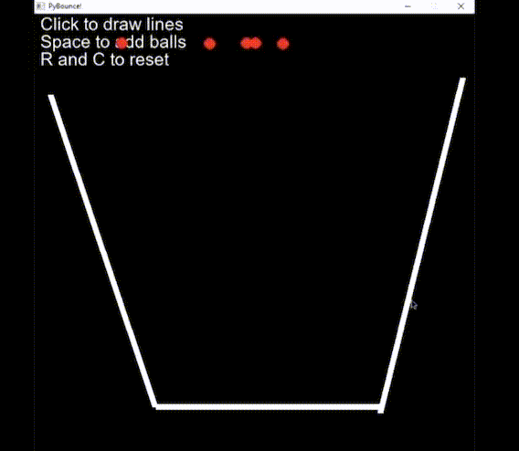
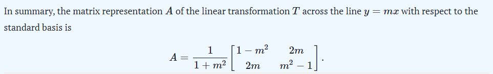

# PyBounce
* First attempt at a physics engine. 
* Provides an approximate simulation of variable elastic collisions under the influence of gravity.
* Utilized pygame graphic module to render the simulation.
* Implemented a linear reflection transformation matrix to accurately predict resulting direction and speed of balls after bounce.
* Wrote efficient mesh collision detection algorithm.
 
Demo 

